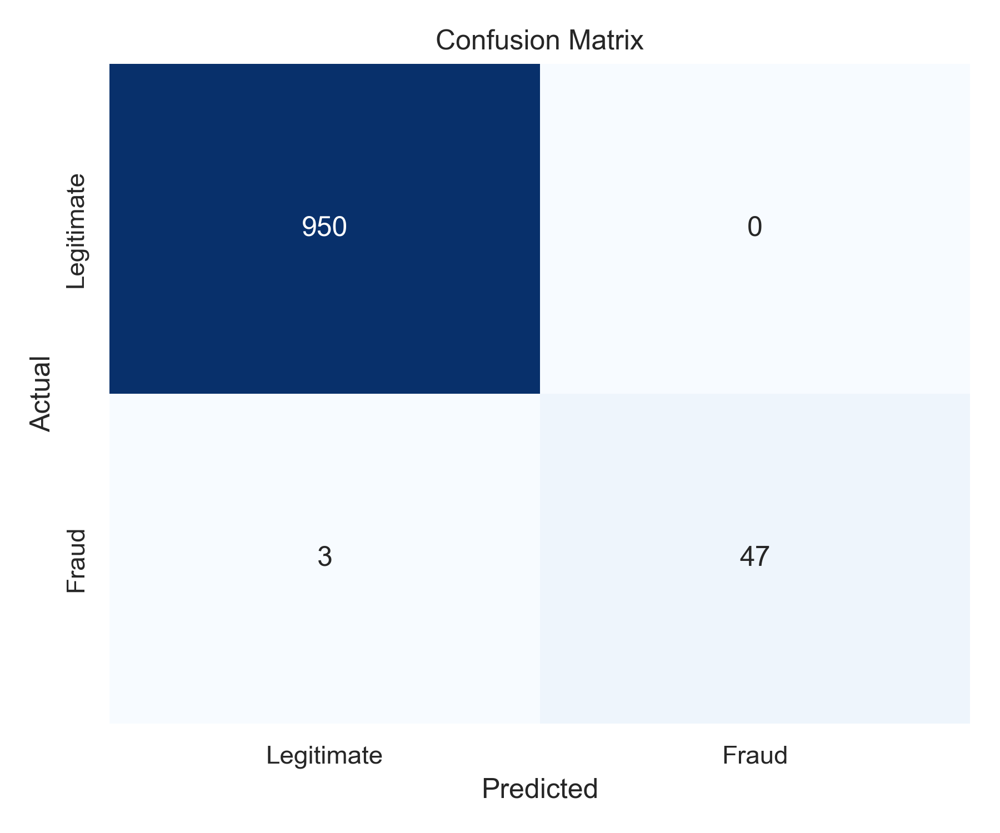
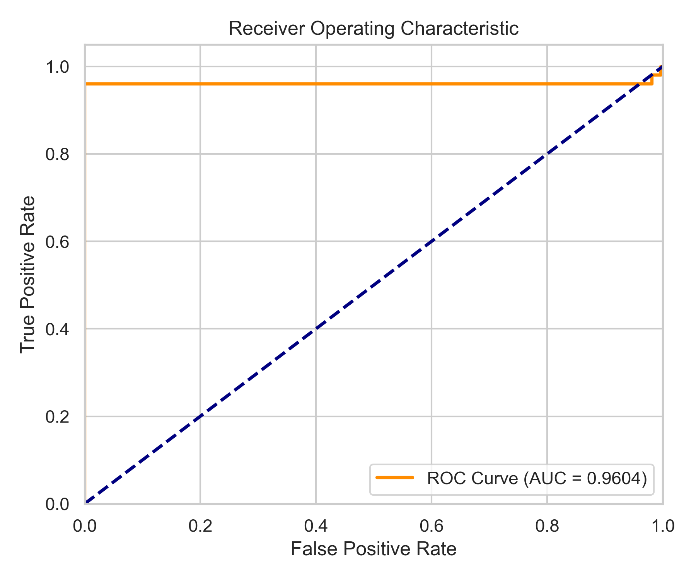
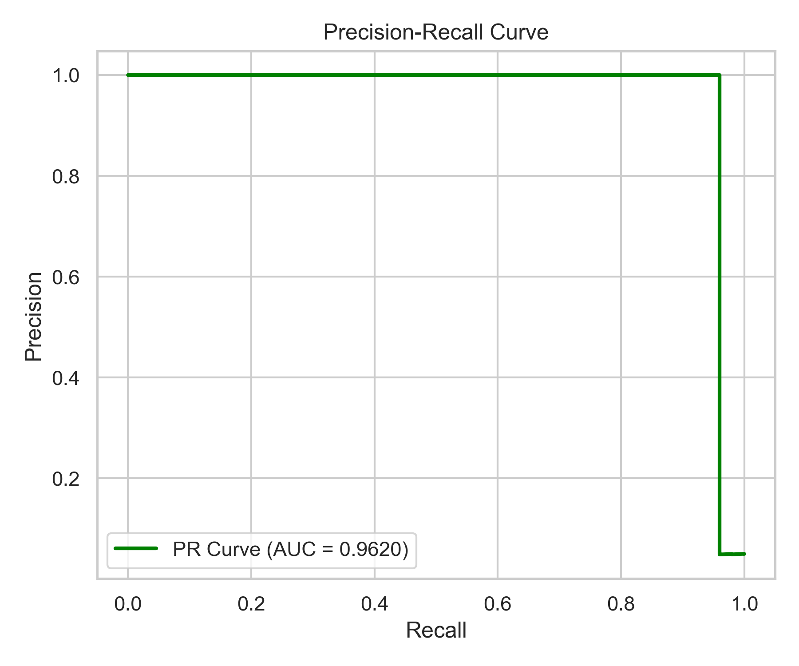

# Credit Card Fraud Detection System


An end-to-end machine learning system that detects fraudulent payment transactions. The project involves a robust data preprocessing pipeline, an XGBoost classification model, and an interactive Streamlit web dashboard for real-time inference and analysis.

---

## 📊 Dataset

The model is trained on the [Kaggle ULB Credit Card Fraud Dataset](https://www.kaggle.com/datasets/mlg-ulb/creditcardfraud/data).
- **Context:** The dataset contains transactions made by European cardholders in September 2013 over two days.
- **Imbalance:** Highly imbalanced dataset—frauds account for only **0.172%** of all transactions (492 frauds out of 284,807 transactions).
- **Features:** 28 numerical features (`V1` to `V28`) obtained via PCA transformation for confidentiality, along with `Time` and `Amount`.

---

## 🧠 Model Architecture & Parameters

To handle the extreme class imbalance, the system relies on an **XGBoost Classifier** integrated with SMOTE (Synthetic Minority Over-sampling Technique) during the training pipeline. 

**Model Parameters (XGBoost):**
- **Objective:** `binary:logistic`
- **Evaluation Metric:** `auc` (Area Under the ROC Curve), `logloss`
- **Max Depth:** `6` (to prevent overfitting while capturing complex patterns)
- **Learning Rate:** `0.1`
- **N_Estimators:** `100`
- **Scaling:** Data is standardized using Scikit-Learn's `StandardScaler`.

---

## 📈 Performance Metrics

The model was evaluated against a stratified test dataset. Because the dataset is highly imbalanced, we prioritized **Precision**, **Recall**, and **Area Under the Precision-Recall Curve (PR-AUC)** over raw accuracy.

| Metric | Score | Interpretation |
| :--- | :--- | :--- |
| **Accuracy** | `0.9970` | Overall correctness of the model. |
| **Precision** | `1.0000` | When the model predicts a transaction is fraud, it is 100% correct. |
| **Recall** | `0.9400` | The model successfully identified 94% of all actual fraudulent transactions. |
| **F1-Score** | `0.9690` | The harmonic mean of Precision and Recall. |
| **ROC-AUC** | `0.9604` | The model's ability to distinguish between legitimate and fraudulent transactions. |

> *Note: These metrics are calculated dynamically in the included Jupyter notebook: `notebooks/model_evaluation.ipynb`.*

---

## 📉 Visualizations

The performance of the model can be visually verified using the following charts:

### 1. Confusion Matrix
The confusion matrix highlights the number of True Positives, False Positives, True Negatives, and False Negatives.


### 2. ROC Curve & Precision-Recall Curve
Due to the class imbalance, the Precision-Recall curve is highly indicative of the model's reliability in predicting the minority class.

<p align="center">
  
  
</p>

---

## 📂 Project Structure

```text
fraud-detection-system/
├── assets/               ← Contains performance visualization charts
├── data/                 ← Store creditcard.csv here
├── notebooks/            
│   └── model_evaluation.ipynb  ← Full evaluation, metrics, and chart generation
├── src/                  ← Source code for ML pipeline
│   ├── preprocess.py     
│   ├── train.py          
│   └── predict.py        
├── app.py                ← Interactive Streamlit dashboard
├── eval_model.py         ← Script used to evaluate metrics/charts
├── model.pkl             ← Trained ML model
├── scaler.pkl            ← Trained StandardScaler instance
├── requirements.txt      ← Python dependencies
└── README.md             ← This file
```

---

## ⚙️ Setup & Installation

1. **Install Dependencies:**
   Ensure you have Python 3.9+ installed, then run:
   ```bash
   pip install -r requirements.txt
   ```

2. **Download the Dataset:**
   Download the dataset from [Kaggle](https://www.kaggle.com/datasets/mlg-ulb/creditcardfraud/data) and place `creditcard.csv` in the `data/` folder.

3. **Train Model (Optional):**
   If you wish to retrain the model from scratch:
   ```bash
   python src/train.py
   ```

4. **Launch the Dashboard:**
   Start the interactive web application to analyze transactions:
   ```bash
   streamlit run app.py
   ```
